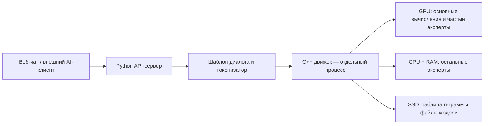

# Strata: обзор репозитория

Дата изучения: 3 октября 2026 года. Версия движка в изученной копии: **0.1.35**.
Последний коммит на момент изучения: `d9ab843` от 2 октября 2026 года.

Обзор составлен по документации и ключевым участкам исходного кода. Установка, запуск модели,
сборка и тесты в рамках этого изучения не выполнялись. Числа производительности ниже взяты
из документации проекта, а не измерены на текущем компьютере.

## Назначение

Strata запускает локально большую MoE-модель **Qwen3.8-Flash-Next** и её поддерживаемые варианты.
Проект объединяет вычислительный движок, API-сервер, веб-чат и установщик для Windows и Linux.

Основная идея — распределять вычисления между видеокартой и процессором, используя VRAM
и системную RAM вместе. Это позволяет запускать модель на ПК, где видеопамяти недостаточно
для размещения всех её весов.

Движок специализирован под семейство Qwen3.8-Flash-Next. Наличие загрузчика GGUF не означает
поддержку произвольной модели в этом формате.

## Структура

| Путь | Назначение |
| --- | --- |
| [`src/core/`](../src/core/) | Загрузка весов, состояние модели, кэш экспертов, управление GPU и сохранение состояния диалогов |
| [`src/kernels/`](../src/kernels/) | Вычислительные ядра GPU и CPU, включая AVX2/AVX-512 |
| [`src/prefill/`](../src/prefill/) | Пакетная обработка входного текста |
| [`src/spec/`](../src/spec/) | Выбор стратегии спекулятивной генерации |
| [`src/artifact/`](../src/artifact/) | Чтение GGUF и деквантизация |
| [`src/ngram/`](../src/ngram/) | Чтение таблицы n-грамм PLE |
| [`src/platform/`](../src/platform/) | Работа с памятью и файлами с учётом платформы |
| [`src/program/generate.cpp`](../src/program/generate.cpp) | Основной драйвер движка: загрузка, вычисления, генерация и кэширование |
| [`include/strata/`](../include/strata/) | Заголовки, интерфейсы и структуры данных C++ |
| [`serve/`](../serve/) | Python HTTP-сервер, адаптеры API, MCP и телеметрия |
| [`serve/web/`](../serve/web/) | Веб-интерфейс на HTML/CSS/JavaScript без frontend-фреймворка |
| [`setup.py`](../setup.py) | Проверка оборудования, установка, скачивание и подготовка моделей, конфигурация запуска |
| [`START-HERE.bat`](../START-HERE.bat), [`setup.sh`](../setup.sh) | Точки входа установки и запуска для Windows и Linux |
| [`chat.py`](../chat.py) | Терминальный клиент работающего сервера |
| [`tools/`](../tools/) | Подготовка весов, токенизатор, калибровка, vision-процесс, MCP-сервер управления и тесты |
| [`tests/`](../tests/) | Проверки компонентов движка, CUDA/HIP и платформенного кода |
| [`bench/`](../bench/) | Бенчмарки и сохранённые результаты измерений |
| [`docs/`](./) | Установка, архитектура, API, модели и особенности оборудования |
| [`CMakeLists.txt`](../CMakeLists.txt), [`cmake/`](../cmake/) | Сборка C++/CUDA/HIP |
| [`Dockerfile`](../Dockerfile) | Контейнерный вариант установки и запуска для Linux/NVIDIA |
| [`third_party/`](../third_party/) | Сторонние компоненты |

## Путь запроса

Python-сервер использует стандартный `ThreadingHTTPServer`. Запрос преобразуется в формат
диалога модели, затем в идентификаторы токенов. Сервер передаёт их постоянно работающему
процессу `strata --serve` через `stdin/stdout` и преобразует выходные токены в текст,
блоки рассуждения и вызовы инструментов.

Движок написан на C++20, использует CUDA либо HIP и компоненты llama.cpp/ggml.
Для изображений предусмотрен отдельный процесс `strata-vision`.

Граница между сервером и движком оформлена через интерфейс `Engine.generate(...)`.
`MockEngine` позволяет проверять сервер без модели и GPU.

Основные файлы: [`serve/server.py`](../serve/server.py),
[`serve/frontend.py`](../serve/frontend.py),
[`tools/strata_tokenizer.py`](../tools/strata_tokenizer.py),
[`src/program/generate.cpp`](../src/program/generate.cpp).

## Особенности движка

- **Гибридное исполнение CPU/GPU.** У базовой модели 48 слоёв и 512 экспертов на слой;
  для токена выбираются 10 экспертов в каждом слое. Часто используемые эксперты хранятся
  в VRAM, остальные вычисляет CPU из RAM. В штатном режиме RAM хранит всех экспертов;
  для ограниченной RAM есть отдельные режимы размещения.
- **Адаптивный кэш экспертов.** Состав экспертов на GPU меняется по ходу работы.
- **Спекулятивная генерация.** Встроенный MTP-модуль предлагает следующие токены,
  а основная модель проверяет их пакетом. Есть также подбор продолжений из уже
  встречавшегося текста, полезный при повторении фрагментов кода и цитировании.
- **Пакетная обработка запросов.** Prefill читает входной текст блоками с перекрытием
  передачи данных и вычислений. Это пакетная обработка токенов одного запроса,
  а не одновременная генерация ответов нескольким клиентам.
- **Экономия памяти контекста.** Поддерживаются разные форматы KV-кэша и перенос
  части кэша в RAM.
- **Повторное использование контекста.** Продолжение диалога может использовать
  уже вычисленное состояние или подходящий checkpoint с точным совпадением префикса.
- **Несколько GPU.** Layer split распределяет последовательные группы слоёв между
  видеокартами. В описанном NVIDIA-сценарии NVLink и peer-to-peer доступ не требуются.

Источники: [как работает Strata](HOW_IT_WORKS.md), [технические детали](DETAILS.md),
[multi-GPU](MULTI_GPU.md), [геометрия модели](../include/strata/core/layout.hpp).

## Возможности для пользователя

| Возможность | Реализация |
| --- | --- |
| Чат и работа с кодом | Веб-интерфейс и терминальный клиент |
| Интеграция с приложениями | OpenAI Chat Completions и Anthropic Messages, потоковые ответы и tool calls |
| Управление рассуждением | Off/low/medium/high; отдельно — жёсткий бюджет токенов рассуждения |
| Изображения | Опциональный vision-энкодер, вложения через интерфейс и API |
| Текстовые вложения | Код, заметки, логи и другие текстовые файлы добавляются в запрос |
| Настройки генерации | Temperature, top-p, top-k, min-p, seed и штрафы повторений |
| Мониторинг | Состояние модели, скорость генерации, GPU/CPU/RAM |
| Просмотр API-запросов | Отдельный опциональный монитор с запросами, ответами, рассуждениями и таймингами |
| Управление ресурсами | Загрузка/выгрузка модели, выгрузка при простое, отложенная загрузка при первом запросе |
| Сохранение чата | История в браузере, экспорт в Markdown |
| Установка | Определение оборудования, подбор настроек, загрузка с продолжением, готовый движок либо сборка |
| Калибровка | Измерение нескольких настроек движка и сохранение выбранных значений; NVIDIA |

Основные API endpoints:

- `POST /v1/chat/completions` — OpenAI Chat Completions.
- `POST /v1/messages` — Anthropic Messages.
- `GET /v1/models`, `GET /props` — сведения о модели и её конфигурации.
- `GET /health`, `GET /status`, `GET /slots`, `GET /metrics` — состояние и мониторинг.
- `POST /v1/load`, `POST /v1/unload` — управление загрузкой настроенной модели.
- `GET /api/requests` — история запросов, когда включён API-монитор.

По умолчанию сервер доступен на `127.0.0.1:8080`. При доступе за пределами localhost
инструкции проекта требуют `--api-key`. Подробности API и настроек: [DETAILS.md](DETAILS.md).

## Две роли MCP

**Strata как MCP-клиент.** [`serve/mcp.py`](../serve/mcp.py) подключает внешние инструменты
к чату через stdio или Streamable HTTP. Модель может вызывать инструменты и продолжать
ответ с их результатами. Внешние API-клиенты сохраняют собственный механизм инструментов;
использование MCP-инструментов сервера включается отдельно через `strata_mcp`.

**Strata как MCP-сервер управления.** [`tools/strata_mcp.py`](../tools/strata_mcp.py)
предоставляет внешнему AI-ассистенту инструменты:

- `strata_status` и `strata_models` — состояние, оборудование и доступные модели;
- `strata_install` — подготовка плана и установка;
- `strata_start` и `strata_stop` — запуск и остановка;
- `strata_logs` — просмотр логов;
- `strata_benchmark` — короткое измерение скорости;
- `strata_connect_info` — параметры подключения приложений.

Подробности: [MCP_SERVER.md](MCP_SERVER.md).

## Модели и требования к памяти

Поддерживаются исходная Qwen3.8-Flash-Next, Coder, Swift 1.5 и экспериментальная
Unsloth UD-Q4_K_XL. Для OrcaRouter есть отдельные инструкции ручной подготовки.

Рекомендации документации по установленной RAM:

| RAM | Основной ориентир |
| --- | --- |
| 32 ГБ | Coder; с большой VRAM отдельные другие варианты доступны через low-RAM режим |
| 48 ГБ | Q2_0 или IQ2_XS |
| 64 ГБ | Все основные размеры, включая IQ3_XXS и IQ3_S; у IQ3_S остаётся меньше запаса |
| 96 ГБ и больше | Больше запаса для крупных вариантов; экспериментальная Unsloth требует отдельного расчёта |

Coder имеет меньше экспертов и ориентирован на код; документация отмечает более слабые
результаты вне программирования, в том числе на китайском и других CJK-текстах.
Swift 1.5 ориентирован на более короткие рассуждения. Unsloth Q4 предъявляет существенно
большие требования к памяти и SSD.

Подробности размеров, VRAM, загрузок и low-RAM режима: [MODELS.md](MODELS.md).

## Производительность из документации

Измерения проекта на **RTX 5070 12 ГБ, Ryzen 5 7600 и 64 ГБ RAM**:

| Модель | Генерация в коротком чате | Обработка входа на запросе 32K токенов |
| --- | ---: | ---: |
| IQ2_XS | 79 токенов/с | 2 090 токенов/с |
| IQ3_S | 53 токена/с | 1 620 токенов/с |

Эти значения относятся к указанному оборудованию и условиям. Они не являются результатом
проверки текущего ПК или гарантией для другого оборудования.
Источник: [MODELS.md](MODELS.md); дополнительные измерения находятся в [bench/results/](../bench/results/).

## Ограничения и экспериментальные функции

- **Один запрос генерируется за раз.** Запросы обслуживаются через очередь FIFO.
- **Кэш нескольких диалогов включается отдельно.** Он хранит состояния в ограниченном
  объёме RAM и ускоряет переключение, но не добавляет параллельную генерацию. По умолчанию
  выключен; совместное использование с layer split сейчас запрещено. Состояния не сохраняются
  между перезапусками.
- **JSON-режим использует инструкцию модели и последующую проверку.** Это не декодирование
  с принудительным соблюдением грамматики. Некорректный результат возвращается как ошибка
  без скрытой повторной генерации. Полная проверка JSON Schema требует дополнительного
  пакета `jsonschema`; без него проверяется только корректность JSON-объекта.
- **Контекст до 262 144 токенов — штатный диапазон.** 384K/512K используют экспериментальное
  расширение через RoPE scaling.
- **Поддержка платформ различается.** У AMD на Windows пока нет изображений, калибровки
  и нескольких GPU на модель. Для AMD на Linux предусмотрен CPU vision-энкодер.
- **Отложенная загрузка сейчас предназначена для текста.** Конфигурация с vision и lazy
  startup явно отклоняется сервером.
- **Experimental speed projection меняет поведение модели.** По документации это проекция
  управляющего вектора, влияющая на ответы и отказы; её нельзя считать гарантированным
  ускорением вычислений. По умолчанию выключена.
- **Поддержка видео отсутствует.**

Источники: [DETAILS.md](DETAILS.md), [AMD_HIP.md](AMD_HIP.md),
[`serve/structured.py`](../serve/structured.py).

## Ориентиры для разработки

Основные точки входа для изменений:

- установка и подбор конфигурации — [`setup.py`](../setup.py);
- API и жизненный цикл модели — [`serve/server.py`](../serve/server.py);
- форматы запросов, шаблон диалога и разбор ответа — [`serve/frontend.py`](../serve/frontend.py);
- веб-интерфейс — [`serve/web/app.js`](../serve/web/app.js);
- координация вычислений и генерации — [`src/program/generate.cpp`](../src/program/generate.cpp);
- состояние и память диалогов — [`src/core/`](../src/core/), файлы `conversation_*`;
- подготовка весов и токенизация — [`tools/`](../tools/).

Низкоуровневые компоненты разнесены по подсистемам, но значительная часть координационной
логики сосредоточена в крупных файлах установщика, сервера и драйвера генерации.

Тесты охватывают установку, API, MCP, жизненный цикл процессов, кэш диалогов и вычислительные
ядра. Они находятся не только в `tests/`, но и в `serve/`, `tools/` и рядом с C++-компонентами.
Часть Python-тестов работает без GPU и загрузки моделей. GitHub Actions workflows в изученной
копии не обнаружены. Наличие тестов здесь не означает, что они были запущены или прошли
в текущем окружении.

Код проекта распространяется под [MIT License](../LICENSE). У сторонних компонентов
и файлов моделей есть собственные лицензии; ссылки приведены в [HOW_IT_WORKS.md](HOW_IT_WORKS.md).
